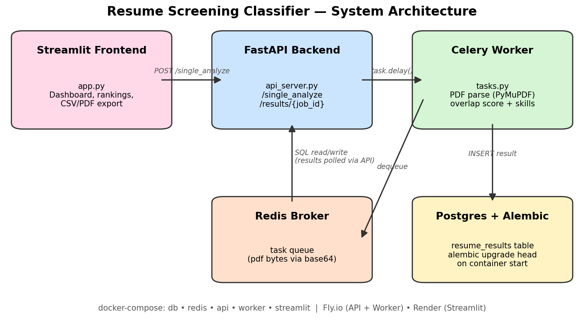

<div align="center">

# 🎯 ResumeRank — AI Resume Screening Classifier

**Upload resumes → get AI-scored, role-classified, fully-searchable candidate rankings — in seconds.**

An end-to-end ML platform with a premium animated UI, an async Celery pipeline, true NER field
extraction, a trained role classifier, user accounts, an admin mission-control dashboard and
Prometheus/Grafana observability — all deployable with one command.


[](https://github.com/FEMZYKENTLTD/Resume-Screening-Classifier/actions/workflows/deploy.yml)


[🎬 Demo](#-demo-video) · [✨ Features](#-features) · [🚀 Quickstart](#-getting-started) ·
[🏗 Architecture](#-architecture) · [🔌 API](#-api-reference) · [☁️ Deploy](#-deployment)

</div>

---

> **👤 Author:** Olufemi Benua Keripe *(a.k.a FEMZYK)* · femzykenterprisesltd@gmail.com
> **🎓 Fellowship:** 3MTT Nextgen Capstone · Fellow ID **FE/26/5786051575**
> **📍 Lagos State, Nigeria** (Alimosho LGA)

---

## 🎬 Demo Video

> 📹 **2–3 minute walkthrough:** *[link to be added — recorded live on the running app]*
>
> The video covers: sign-up → paste a Job Description → batch-screen real resumes →
> animated score ring & rankings → extracted fields (NER) → My History export →
> Admin dashboard → a peek at the Celery worker processing jobs live.

## 📸 Screenshots

| | |
|---|---|
| **Pipeline architecture** |  |

> The UI is best experienced live — every dashboard is animated (glassmorphism cards,
> count-up KPIs, animated score ring, aurora background). See [🎨 Aurora Design System](#-aurora-design-system).

---

## 🎯 About The Project

**ResumeRank** automates the most tedious part of recruitment — reading every resume against
every job description. HR pastes a JD, drops in a stack of PDF/DOCX resumes, and gets an
instant, explainable ranking: match score, predicted profession, extracted contact fields,
matched keywords, skill cloud, trend charts and one-click CSV/PDF reports.

Under the hood it's an **enterprise-style async architecture**, not a notebook script:

```
Streamlit UI  ──POST /single_analyze──▶  FastAPI  ──▶ parse → extract (NER)
     ▲                                         │      → classify (ML) → score
     │                                         ▼
     └── GET /results/{job_id}  ◀──  PostgreSQL  ◀──persist── completed result
                                     ▲
        Redis ──▶ Celery worker ─────┘  (optional async lane — tasks.py,
                                         Dockerfile.worker / Dockerfile.worker.ml)
```

- ⚡ The API runs the whole pipeline **synchronously** (`POST /single_analyze` returns the
  completed result in one round-trip) — instant feedback for interactive screening
- 🧵 Need higher throughput? An **async Celery lane** ships too: `tasks.py` + Redis +
  `celery worker --concurrency=N` scales horizontally behind the same API contract
- 🗄️ Schema is **Alembic-managed** (single linear head, auto-applied on deploy)
- 📊 Every request/job emits **Prometheus metrics**, charted by a provisioned Grafana board

---

## ✨ Features

### 🧪 Core Screening
| Feature | Detail |
|---|---|
| 📄 **PDF + DOCX parsing** | PyMuPDF + python-docx, multi-file batch upload |
| 🎯 **Match score (0–100 %)** | Meaningful-term overlap: stopwords excluded, log-damped term frequency, 2× weight for known tech skills. Returns the matched **and missing** skills, not just a number |
| 🧠 **Semantic matching** *(optional)* | `ENABLE_SEMANTIC=1` — sentence-transformers embeddings blended `0.65 semantic / 0.35 keyword`, with **skill-gap analysis** |
| 🔍 **Field extraction** | name, email, phone, years of experience, education, organizations |
| 🏆 **Rankings & badges** | Animated leaderboard (🥇🥈🥉), CSV/PDF export |
| ☁️ **Skill cloud** | Word-cloud of matched keywords, Aurora-themed |

### 🤖 AI & Intelligence
| Feature | Detail |
|---|---|
| 🗣 **True NER** | spaCy `en_core_web_sm` → PERSON / ORG extraction, with a **skill-lexicon guard** (stops "Docker" being read as a name 😅) and regex fallback when the model isn't installed |
| 🧑‍💼 **Trained role classifier** | TF-IDF + logistic regression over **9 role families**, trained on **619 resume-shaped documents** (`training/corpus.py` generator + curated rows). Accepts the ML vote on **confidence *or* margin over the runner-up**. Held-out accuracy **100% over 141 unseen docs**, **4/4** on the real demo PDFs, **6/6** on deliberately ambiguous overlap cases |
| ♻️ **Smart duplicate detection** | identical resume + identical JD short-circuits to the cached analysis (API check + unique DB index) — watch the "smart cache hit" badge |
| 🛡 **Graceful degradation** | spaCy / sentence-transformers / scikit-learn are **optional extras** — base images stay lean, features fall back cleanly |

### 👥 Accounts, History & Admin
| Feature | Detail |
|---|---|
| 🔐 **Signup / Login** | bcrypt-hashed passwords, signed expiring tokens (`itsdangerous`) — no plaintext anywhere |
| 🗂 **My History** | every analysis attributed to you (`resume_results.user_id`), filterable, exportable |
| 🛠 **Admin dashboard** | user registry table, per-user drill-down, jobs/day, signups/day, profession & tech-stack distributions, score histogram — gated by `ADMIN_USERNAMES` (anon **401**, non-admin **403**, machine-verified) |

### 🏗 Platform & Ops
| Feature | Detail |
|---|---|
| 🐳 **One-command stack** | `docker compose up` → db, redis, api, worker, streamlit, prometheus, grafana |
| 🔄 **Auto-migrations** | `alembic upgrade head` runs on container start / Fly release command |
| 📈 **Observability** | `/metrics` on API **and** worker; Grafana dashboard provisioned out-of-the-box |
| ✅ **CI/CD** | compile-check → test suite → migration-check → deploy (Fly.io API+worker, Render UI) |

### 💜 UI/UX — "Aurora" *(new in v5.5)*
- 🌈 **Animated aurora background** — four drifting, blurred gradient orbs (indigo / fuchsia / cyan / blue)
- 🪟 **Glassmorphism cards** with backdrop blur, soft shadows and hover-lift physics
- 🔢 **Count-up KPI tiles** with staggered entrance choreography
- ⭕ **Animated score ring** — SVG stroke-dash draw + eased number counter, color-coded by score band
- 🌌 **Deep-space sidebar** with sliding nav pills, glowing avatar chip and live API status pulse
- 🎨 Gradient buttons, segmented mode pills, animated progress bar, styled tabs, balloons at 80 %+ 🎈
- ♿ Respects `prefers-reduced-motion`; fonts degrade gracefully offline

*Deliberately **not** the generic black-and-gold look.*

---

## 🎨 Aurora Design System

| Token | Value | Used for |
|---|---|---|
| Primary gradient | `#6366F1 → #8B5CF6 → #D946EF` | buttons, highlights, hero title |
| Accent gradient | `#06B6D4 → #22D3EE` | downloads, secondary actions |
| Background | `#EEF1F9` + aurora orbs (`#C4B5FD`, `#A5F3FC`, `#F5D0FE`, `#BFDBFE`) | page canvas |
| Cards | `rgba(255,255,255,.74)` + `backdrop-blur(14px)` | glass surfaces |
| Sidebar | `#150F38 → #22195C → #2E2574` | deep-space nav rail |
| Text | `#0F172A` / `#64748B` | headings / muted |
| Success · Warning · Danger | `#10B981` · `#F59E0B` · `#F43F5E` | status semantics |
| Fonts | Space Grotesk (headings) · Plus Jakarta Sans (body) | typography |

---

## 🛠️ Tech Stack

### Backend
- **[FastAPI](https://fastapi.tiangolo.com/)** + Uvicorn — REST API (multipart upload, job polling)
- **[Celery 5](https://docs.celeryq.dev/)** + **Redis** — async worker pool
- **SQLAlchemy 2 + Alembic** — ORM + versioned migrations
- **bcrypt + itsdangerous** — auth primitives
- **prometheus-client** — metrics

### AI / ML
- **PyMuPDF**, **python-docx** — document parsing
- **spaCy `en_core_web_sm`** *(optional)* — NER
- **scikit-learn** *(optional)* — role classifier
- **sentence-transformers** *(optional)* — semantic embeddings

### Frontend
- **Streamlit** — app shell (`st.set_page_config`, AppTest-verified)
- **Altair + Vega** — charts · **Matplotlib + WordCloud** — skill cloud
- **fpdf2** — PDF reports
- Hand-written **CSS/inline-SVG/JS component layer** (zero external frontend deps)

### DevOps
- **Docker Compose** (7 services) · **Fly.io** (API + worker) · **Render** (Streamlit) · **Supabase** (Postgres)
- **GitHub Actions** — CI gate + auto-deploy

---

## 🏗 Architecture


**Request lifecycle:**

1. HR uploads resumes in the **Streamlit** app → `POST /single_analyze` (multipart)
2. **FastAPI** validates auth, hashes `(file, JD)` for duplicate short-circuit, then runs the pipeline **inline**: parse (PDF/DOCX) → extract fields (NER) → classify role (ML) → score → persist to **Postgres** → returns the completed result
3. Deployments that prefer the async lane run the identical pipeline in a **Celery worker** (`tasks.py`) behind Redis — same schema, same scoring
4. `GET /results/{job_id}` returns any job's state: `queued → processing → completed/failed`
5. Dashboards (`/analytics/summary`, `/admin/*`, `/history`) aggregate everything in real time

---

## 📁 Project Structure

```
Resume-Screening-Classifier/
│
├── 📄 api_server.py            # FastAPI: analyze · results · auth · history · analytics · admin · metrics
├── 📄 tasks.py                 # Celery task: parse → extract → classify → score → persist
├── 📄 app.py                   # Streamlit "Aurora" UI — Screening / Analytics / My History / Admin
├── 📄 auth.py                  # bcrypt hashing + signed expiring tokens
├── 📄 parsing.py               # PDF (PyMuPDF) + DOCX → clean text
├── 📄 ner.py                   # optional spaCy NER (guarded import)
├── 📄 extractors.py            # name/email/phone/experience/education (+ skill-lexicon name guard)
├── 📄 skills.py                # curated tech-skill lexicon
├── 📄 roles.py                 # keyword-profile role classifier (fallback)
├── 📄 role_model.py            # trained TF-IDF + logistic-regression classifier
├── 📄 scoring.py               # match score (0–100) + gap analysis
├── 📁 training/
│   ├── 📄 pseudonymize.py      # strip PII from REAL resumes (fail-closed audit)
│   └── 📄 ingest_real_resumes.py # folder of real CVs -> safe training corpus
├── 📄 matching_engine.py       # optional semantic matching (sentence-transformers)
├── 📄 monitoring.py            # Prometheus helpers
├── 📄 models.py                # SQLAlchemy models
├── 📄 database.py              # env-driven engine/session
│
├── 📁 migrations/              # Alembic — single linear head (7 revisions)
├── 📁 models/
│   └── role_classifier.joblib  # trained artifact (committed, ~170 KB)
├── 📁 training/                # auditable training corpus + train_role_classifier.py
├── 📁 tests/
│   └── test_core.py            # 31 end-to-end tests (SQLite + eager Celery)
├── 📁 scripts/
│   └── verify_ui_live.py       # 21-check live E2E (AppTest + HTTP round-trips)
├── 📁 demo/resumes/            # 🎬 demo kit: 4 sample resumes (+ job_description.txt)
├── 📁 .streamlit/
│   └── config.toml             # server + Aurora theme
├── 📁 monitoring/              # prometheus.yml + Grafana provisioning & dashboards
├── 📁 docs/images/             # architecture diagram
│
├── 🐳 Dockerfile.api / .worker / .worker.ml / .streamlit
├── 🐳 docker-compose.yml       # db · redis · api · worker · streamlit · prometheus · grafana
├── ☁️ fly.api.toml / fly.worker.toml / render.yaml
├── ⚙️ .github/workflows/deploy.yml
└── 📄 alembic.ini · requirements.txt · .env.example · wait-for-db.sh
```

---

## 🚀 Getting Started

### Prerequisites

| Tool | Version | Get it |
|---|---|---|
| Docker + Compose | 24 + v2 | [docker.com](https://docs.docker.com/get-docker/) |
| Python *(local dev only)* | 3.11 + | [python.org](https://www.python.org/downloads/) |

### 🐳 Option A — Docker Compose (everything, one command)

```bash
git clone https://github.com/FEMZYKENTLTD/Resume-Screening-Classifier.git
cd Resume-Screening-Classifier
cp .env.example .env      # defaults work out-of-the-box for local dev
docker compose up --build
```

Then open:

| Service | URL |
|---|---|
| 🎨 **Streamlit UI** | http://localhost:8501 |
| ⚡ FastAPI docs | http://localhost:8000/docs |
| 📊 Grafana (admin/admin) | http://localhost:3000 |
| 📈 Prometheus | http://localhost:9090 |

Migrations run automatically on API start. Sign up on the UI, or make yourself admin by
adding your username to `ADMIN_USERNAMES`.

### 🐍 Option B — Local dev (hot reload)

```bash
python -m venv .venv && source .venv/bin/activate
pip install -r requirements.txt
# optional ML extras (NER + trained classifier + semantic):
pip install scikit-learn==1.9.0 spacy==3.8.16 sentence-transformers==6.0.0 \
  "https://github.com/explosion/spacy-models/releases/download/en_core_web_sm-3.8.0/en_core_web_sm-3.8.0-py3-none-any.whl"

# terminal 1 — db + redis (or point env vars elsewhere)
docker compose up db redis
# terminal 2 — worker
celery -A tasks.celery_app worker --loglevel=INFO
# terminal 3 — API (applies migrations on start for sqlite/dev)
uvicorn api_server:app --reload --port 8000
# terminal 4 — UI
API_URL=http://localhost:8000 streamlit run app.py
```

### 🔧 Configuration

| Variable | Default | Purpose |
|---|---|---|
| `DATABASE_URL` | compose Postgres | SQLAlchemy URL (Supabase in prod) |
| `REDIS_URL` | compose Redis | Celery broker/backend (`rediss://` for Upstash TLS) |
| `API_URL` | `http://localhost:8000` | where the UI finds the API |
| `AUTH_SECRET_KEY` | **change me!** | token-signing secret (long random string in prod) |
| `TOKEN_MAX_AGE_DAYS` | `7` | session token lifetime |
| `ADMIN_USERNAMES` | `admin` | comma-separated admin usernames |
| `ENABLE_SEMANTIC` | `0` | `1` = blend embedding score (needs sentence-transformers) |
| `HR_PASSWORD` / `RECRUITER_PASSWORD` / `COOKIE_KEY` | — | **legacy** offline login only (API down) |

⚠️ Never commit `.env`. Fly.io does **not** interpolate `${VAR}` in TOML — set secrets with
`fly secrets set` (see [Deployment](#-deployment)).

---

## 💻 Usage Guide

### Screening candidates
1. **🔑 Sign up / log in** — animated glass portal greets you
2. **📄 Paste the Job Description** — e.g. *"Data Engineer: Python, SQL, Airflow, GCP…"*
3. **📂 Upload resumes** — PDF/DOCX, one or a whole folder
   *(no CVs handy? the demo kit ships 4 realistic samples in `demo/resumes/` plus a ready-made JD in `demo/job_description.txt`)*
4. Pick **Single Analysis** or **Batch Screening** → **⚡ Run AI Analysis**
5. Walk through the results:
   - ⭕ animated **score ring** (single mode) with extracted contact fields
   - 📊 per-candidate bar chart + score trend (batch mode)
   - ☁️ keyword cloud · 🏆 ranked leaderboard with medals & cache-hit badges
   - 📥 one-click **CSV / PDF export** (results persist across reruns)

### 🗂 My History
Every analysis you run is saved to your account — filter by score, inspect extracted fields,
re-export anytime.

### 📈 Analytics
Fleet-wide vitals: jobs processed, avg match score, top role, score histogram, pipeline donut,
role & skill distributions, recent jobs.

### 🛠 Admin (admins only)
Mission control: user registry, per-user job drill-down, jobs/day, signups/day, profession mix,
tech-stack mix, score histogram — plus a **401/403 security gate** (machine-verified).

---

## 🔌 API Reference

| Method | Endpoint | Auth | Description |
|---|---|---|---|
| `GET` | `/health` | — | liveness probe |
| `POST` | `/auth/signup` | — | create account → `{ token }` |
| `POST` | `/auth/login` | — | `{ username, password }` → `{ token, is_admin }` |
| `POST` | `/single_analyze` | optional | multipart resume + JD → `200` completed result (dedup-aware) |
| `GET` | `/results/{job_id}` | — | job status → score, role, fields, skills |
| `GET` | `/history` | 🔒 | caller's analyses |
| `GET` | `/analytics/summary` | — | distributions, histograms, recent jobs |
| `GET` | `/admin/overview` | 👑 | users/jobs/status totals |
| `GET` | `/admin/users` | 👑 | user registry w/ job stats |
| `GET` | `/admin/users/{id}/jobs` | 👑 | per-user drill-down |
| `GET` | `/admin/trends?days=N` | 👑 | activity & distribution trends |
| `GET` | `/metrics` | — | Prometheus exposition (API + worker) |

Interactive docs: **`/docs`** on the API (Swagger UI).

---

## 🧪 Testing & Verification

### Scoring: why every resume used to get roughly the same number

The original score was a plain set intersection:

```python
100 * len(set(jd_words) & set(resume_words)) / len(set(jd_words))
```

Two defects made it nearly useless:

1. **Stopwords counted as matches.** "and", "of", "with", "experience", "years",
   "team" appear in every JD and every resume, so every candidate collected the
   same free points — a score *floor*.
2. **The denominator was every word in the JD**, including that same filler, so
   real skill matches were diluted into a narrow band.

Measured on the real demo JD, a resume containing **no relevant skills at all**
scored **14%** — *identical* to a genuine data analyst. A string of pure
stopwords scored **12%**. That is the "same generic number" effect.

The rewrite (`scoring.py`) fixes it by:

- excluding a `STOPWORDS` set (English filler + recruiter boilerplate + degree
  and location tokens) from **both** sides,
- scoring only *meaningful* JD terms, so the denominator reflects real requirements,
- damping repetition with `1 + ln(count)` so keyword-stuffing cannot game it,
- weighting known `TECH_SKILLS_DB` skills **2×**,
- returning `matched_skills` / `missing_skills` so the UI can show the **gap**.

A tokenizer bug surfaced during the fix: trailing punctuation stuck to tokens,
so `bigquery.` ≠ `bigquery` and genuinely-met requirements were silently
reported as missing. Tokens are now right-stripped of `.,;:!?)/-` while
`c++`, `c#`, `ci/cd` and `node.js` survive intact.

| | before | after |
|---|---|---|
| boilerplate-only resume | 14% | **0%** |
| real data engineer (matching JD) | 41% | **80%** |

Each demo resume now scores highest against its own role — a perfect diagonal:

| resume | DataEng | Frontend | DataSci | Analyst |
|---|---|---|---|---|
| chiamaka (analyst) | 26 | 0 | 24 | **47** |
| fatima (data science) | 18 | 0 | **40** | 23 |
| ibrahim (frontend) | 0 | **32** | 0 | 0 |
| tunde (data engineering) | **65** | 0 | 12 | 18 |

---

### Training on real resumes (pseudonymized)

Synthetic data teaches document *shape*; real CVs teach the messy vocabulary
people actually write. Real resumes are also personal data, so they are never
committed — instead the repo ships the pipeline to ingest your own safely:

```bash
real_resumes/
  Data Engineering/       cv1.pdf  cv2.docx
  Frontend Engineering/   ...

python -m training.ingest_real_resumes real_resumes/
python -m training.train_role_classifier    # auto-detects the corpus
```

`training/pseudonymize.py` removes names, emails, phone numbers, URLs and
social handles, street addresses, dates of birth and national-ID/BVN-style
numbers, while **preserving** job titles, skills, employers, dates and
education — the signal the classifier actually learns from. Names become
*deterministic* pseudonyms, so one person stays consistent across documents
without the real name ever being stored.

The pipeline **fails closed**: every scrubbed document is re-audited, and any
that still contains a direct identifier is **rejected, not written**. The
scrubber and auditor share one `_is_phone()` rule so they cannot disagree.
`training/real_corpus.jsonl` is git-ignored by default.

> ⚠️ Pseudonymization reduces risk; it does not grant permission. Only ingest
> resumes you have a lawful basis to process (NDPR / GDPR).

---

Everything claimed above is **machine-verified**, not vibes:

```bash
pytest tests/ -q                     # 81 tests — full stack on SQLite + eager Celery
                                     #   • with spaCy + scikit-learn:   80 passed, 1 model-only skip
                                     #   • bare CI (no ML extras):      72 passed, 9 auto-skips
python -m training.train_role_classifier   # retrain + REFUSE to ship a bad model
python scripts/verify_ui_live.py     # 21 passed — drives the REAL running stack:
                                     # HTTP login → PDF through the pipeline → AppTest on every page
```

**Resilience suite** (added in v5.7, covering the production `/single_analyze` 500):

| Test | Guards against |
|---|---|
| `test_sanitize_text_strips_db_hostile_characters` | NUL / control chars / lone surrogates from real PDFs |
| `test_parsed_output_is_postgres_encodable` | psycopg2 refusing to adapt parsed text (the live 500) |
| `test_pdf_parsing_preserves_line_structure` | PDF text collapsing onto one line, breaking name extraction |
| `test_single_analyze_survives_hostile_pdf_text` | hostile resumes returning 500 instead of 200 |
| `test_single_analyze_degrades_when_ml_extras_explode` | a corrupt/OOM ML artifact taking down the endpoint |
| `test_error_responses_do_not_leak_internals` | DSNs / stack details leaking in 5xx bodies |
| `test_analyze_via_api_never_raises` | `requests.HTTPError` escaping into the Streamlit UI |
| `test_safe_json_tolerates_corrupt_rows` | one bad JSON column 500-ing history/results |
| `test_alembic_migrations_have_single_head` | a split head breaking `alembic upgrade head` on deploy |

**Model & correctness suite** (v5.7):

| Test | Guards against |
|---|---|
| `test_classifier_fires_on_real_resume_pdfs` | the trained model never firing on real CVs (asserts `method == "ml-model"` on all 4 demo PDFs) |
| `test_model_artifact_reports_honest_heldout_metric` | shipping an artifact whose only metric is measured on synthetic text |
| `test_margin_rule_accepts_confident_and_rejects_flat` | the accept/reject decision rule regressing |
| `test_data_analyst_profile_exists` | analyst CVs falling into *General / Uncategorized* |
| `test_classify_role_degrades_when_model_raises` | a corrupt artifact propagating instead of falling back |
| `test_cplusplus_is_extractable` | `\bc\+\+\b` silently never matching C++ |
| `test_skill_display_names_are_not_mangled` | "Node.Js" / "Ci/Cd" / "Rest Api" leaking into UI, CSV and PDF |
| `test_extract_skills_no_false_positives` | substring matches ("go" in "going") |
| `test_long_password_does_not_crash_signup` | bcrypt's 72-byte limit 500-ing `/auth/signup` |
| `test_bcrypt_truncation_never_splits_a_character` | truncation emitting invalid UTF-8 |

`verify_ui_live.py` performs true end-to-end round-trips: real logins (admin + non-admin),
a generated PDF pushed through `single_analyze → pipeline → DB → results`, then
`streamlit.testing.AppTest` renders **every page** (login, screening, analytics, history,
admin incl. 401/403 gating) and asserts zero exceptions.

CI runs the same gates on every push: **compile → migrate-check → test suite → deploy**.

---

## 🛠 Troubleshooting

### `500 Server Error ... /single_analyze` (fixed in v5.7)

The live UI used to surface a raw traceback:

```
requests.exceptions.HTTPError: 500 Server Error: Internal Server Error
for url: https://resume-api-femi.fly.dev/single_analyze
```

Three independent defects combined to produce it:

1. **Un-sanitized document text hit PostgreSQL.** PyMuPDF happily returns NUL
   bytes and lone UTF-16 surrogates from CVs with broken font/ToUnicode maps.
   PostgreSQL rejects `\x00` in `TEXT` outright and psycopg2 cannot encode
   surrogates, so the `db.commit()` raised and the handler mapped it to a 500.
   → `parsing.sanitize_text()` now scrubs every parsed string, and the JD is
   sanitized and length-capped too.
2. **Optional ML extras were treated as mandatory.** A missing/corrupt
   `role_classifier.joblib`, or an OOM-killed spaCy load on a small Fly VM,
   propagated straight out of the handler — despite the documented "graceful
   degradation". → NER, role classification and skill extraction are each
   wrapped; failures are recorded in `match_details` and the analysis still
   completes.
3. **The Streamlit client turned any API error into a crash.**
   `analyze_via_api()` called `resp.raise_for_status()`, so a single failing
   upload killed the whole script with a traceback instead of falling back to
   the local score it had already computed. → it now returns `(payload, error)`
   and never raises; the UI degrades to local mode with a warning.

**Operational notes**

- Set `DEBUG_ERRORS=1` on the API to echo the exception type/message in 5xx
  bodies while diagnosing; leave it off in production (responses stay generic
  and the full traceback is logged server-side instead).
- Tune the UI's patience for cold Fly machines with `API_ANALYZE_TIMEOUT`
  (seconds, default `120`).
- `fly logs --app resume-api-femi` now shows a structured
  `Analysis failed for <file>` line with the full traceback for any residual
  failure.

### `en_core_web_sm` fails to install (blocked GitHub CDN)

**Short answer: it does not break anything — but you should still fix it, because
without it you lose real NER.**

spaCy models are *not* on PyPI. They are published as GitHub **release assets**,
served from a different host than `github.com`:

```
github.com                         ✅ usually allowed
release-assets.githubusercontent.com   ❌ often blocked by proxies/CI egress
```

The Dockerfiles used to pin that URL inside the same `RUN pip install` layer as
everything else, so a blocked CDN **failed the entire image build** — for a
feature that is documented as optional. That is now fixed:
`scripts/install_spacy_model.sh` tries `python -m spacy download` first, falls
back to the pinned URL, verifies the model actually loads, and **exits 0 either
way** so a deploy can never die over an optional extra.

**What you lose if the model is genuinely absent**

| | With `en_core_web_sm` | Without |
|---|---|---|
| Candidate name | spaCy `PERSON` entity | regex heuristic (first Title-Case line) |
| Organizations | spaCy `ORG` entities | *empty list* |
| `extraction_method` | `spacy-ner` | `regex-heuristic` |
| Scoring, role, skills, dedup | unaffected | unaffected |

So: screening keeps working and nothing 500s, but **employer extraction goes
away** and name detection gets weaker on unusual layouts. Check which mode you
are in with `extracted_fields.extraction_method` in any API response.

**Fixing it in a restricted network** — pick whichever fits:

```bash
# 1. allowlist the asset host, then rebuild
#    release-assets.githubusercontent.com, objects.githubusercontent.com

# 2. vendor the wheel and install from your own storage / build context
pip download en_core_web_sm --no-deps -d vendor/    # on an unrestricted machine
pip install vendor/en_core_web_sm-3.8.0-py3-none-any.whl

# 3. force the build to fail loudly instead of shipping without NER
docker build --build-arg SPACY_MODEL_REQUIRED=1 -f Dockerfile.api .
```

> 🧪 The NER **code path** is tested regardless: `test_ner_code_path_with_offline_spacy_pipeline`
> builds a blank spaCy pipeline with an `entity_ruler`, producing genuine
> `Doc`/`Span` objects with no download. Only the pretrained *weights* are
> unavailable offline, so the integration never goes unverified.

### Other common issues

| Symptom | Cause / fix |
|---|---|
| `No readable text in '<file>'` (400) | scanned image PDF — needs OCR before upload |
| `Storage backend unavailable` (503) | database unreachable; check `DATABASE_URL` / Supabase status |
| Sidebar shows *API offline — local mode* | `API_URL` wrong or the API is asleep; scoring falls back to local keyword matching |
| Role always `General / Uncategorized` | scikit-learn not installed — the classifier falls back to keyword profiles |

---

## ☁️ Deployment

| Piece | Platform | Notes |
|---|---|---|
| PostgreSQL | **Supabase** (or any PG 15) | schema auto-applied via `release_command = alembic upgrade head` |
| Redis | **Upstash** | use the `rediss://` TLS URL |
| API + Worker | **Fly.io** | two apps: `fly.api.toml`, `fly.worker.toml` |
| Streamlit UI | **Render** | `render.yaml`, env `API_URL` → Fly API |
| CI/CD | GitHub Actions | `.github/workflows/deploy.yml` |

**Secrets map** (the part tutorials get wrong):

| Where | Secrets |
|---|---|
| GitHub → Settings → Secrets | `FLY_API_TOKEN` · `RENDER_API_KEY` · `RENDER_STREAMLIT_ID` (the `srv-xxxxxx` id) |
| Fly app secrets | `fly secrets set DATABASE_URL=… REDIS_URL=… AUTH_SECRET_KEY=… ADMIN_USERNAMES=… --app <api-app>` (repeat for the worker app) |
| Render env | `API_URL=https://<your-api>.fly.dev` |

> 🪤 **Trap:** `fly.toml` does *not* expand `${DATABASE_URL}` — put real values in Fly secrets, not in the TOML.

---

## 📊 Monitoring

- API **and** worker expose `/metrics` (request latency, task throughput, failures)
- Compose stack includes **Prometheus** (pre-configured scrape targets) and **Grafana**
  with a provisioned *ResumeRank Overview* dashboard — zero clicks to graphs

---

## 🆕 What's new in v5.8 — the classifier gets a real corpus

- 📚 **619-document training corpus** (`training/corpus.py`) — a seeded, reproducible
  generator that emits **resume-shaped** documents: name, contact line, title, summary,
  dated employment history with employers, skills line, degree, and soft-skill filler.
  That scaffolding is the realistic noise the old 56 keyword blurbs completely lacked
- 🎯 **Confidence roughly doubled on the real demo PDFs** — 0.43→0.55, 0.52→0.75,
  0.39→0.61, 0.42→0.73, all four still correct and all served by the ML model
- 🧩 **6/6 on deliberately ambiguous overlap cases** — including the Data-Engineering
  resume loaded with Docker/Kubernetes/CI/CD that originally misfired as *DevOps*
- 🚧 **Train/test splits are provably disjoint** — different seeds *and* disjoint pools
  of names, employers and cities, so a held-out doc can never echo a training doc
- 🛑 **The training script refuses to ship a bad model.** It hard-fails if held-out
  accuracy < 0.80, if the hand-written probes regress, if the **real demo PDFs** are not
  100% correct, or if the **serving rule would accept < 95%** of held-out docs. That last
  gate is the one that would have caught the original bug, where the model was accurate
  but too flat to ever be used
- 📈 **Per-class reporting** — accuracy, mean confidence and mean margin for all 9 roles,
  so one broken class can't hide behind a good average
- 🕵️ **NER guard hole closed** — the skill-lexicon check rejected "Docker" as a name in
  the spaCy path, but the **regex fallback happily re-introduced it**. Both paths guarded
- 🧨 **Admin page crash fixed** — `/admin/users/{id}/jobs` never returned
  `skills_extracted`, yet the drill-down hard-indexed that column, so the whole Admin
  page died with a pandas `KeyError` for any admin who had run a job. API now returns it
  and the UI selects columns defensively
- 🌐 **spaCy model install no longer risks the build** — see
  [Troubleshooting](#en_core_web_sm-fails-to-install-blocked-github-cdn)

---

## 🆕 What's new in v5.7 — reliability hardening

- 🩹 **Fixed the live `500` on `POST /single_analyze`** — parsed text is now scrubbed of
  NUL bytes, control characters and lone surrogates before it can reach PostgreSQL
  (see [🛠 Troubleshooting](#-troubleshooting) for the full root-cause writeup)
- 🛡 **Optional ML extras genuinely degrade now** — a corrupt `role_classifier.joblib`
  or an OOM-killed spaCy load records an error in `match_details` and still returns a
  completed analysis instead of a 500
- 🧯 **The UI can no longer crash on an API error** — `analyze_via_api()` returns
  `(payload, error)` and never raises; failed uploads fall back to the local score
- 📛 **Correct HTTP semantics** — `400` empty file/JD, `409` dedup race, `503` database
  down, `500` only for genuine internal faults (and bodies no longer leak internals)
- 📄 **PDF line structure preserved** — pages are newline-joined, so candidate-name
  extraction works on PDF resumes again (it previously collapsed the CV onto one line)
- 🔐 **`streamlit-authenticator` 0.3.x *and* 0.4.x supported** in the offline-login path
- 🧪 **+13 regression tests** (44 unit total) incl. a psycopg2-adapter proof and an
  Alembic single-head guard
- 🪵 **Structured server-side logging** with full tracebacks; `DEBUG_ERRORS=1` to echo
  details, `API_ANALYZE_TIMEOUT` to tune UI patience for cold machines

**Model & data-quality fixes (second audit pass):**

- 🧠 **The trained classifier now actually runs.** The corpus was short keyword
  blurbs while real CVs carry contact/education/employer noise — that train/serve
  mismatch kept the top probability near 0.26–0.30, under the old `MIN_CONFIDENCE=0.45`
  gate, so **every real upload silently fell back to keyword profiles** (which also
  mislabelled the data engineer as *DevOps*). Fixed with resume-shaped training data,
  a **margin-based** accept rule, and a held-out set that the training run enforces.
  Real demo PDFs went from **2/4 correct (0 via ML)** → **4/4 correct, all via ML**
- 📊 **Honest metrics.** `cv_macro_f1: 1.0` was measured on synthetic blurbs and did not
  transfer. The artifact now also records `heldout_accuracy` on never-trained-on,
  resume-shaped probes, and `train_role_classifier.py` **refuses to save** below 0.80
- 🆕 **New role family: `Data Analytics / BI`** — analyst CVs previously had no valid
  label anywhere and landed in *General / Uncategorized*
- 🔤 **`C++` was undetectable.** `\bc\+\+\b` can never match ('+' is a non-word char,
  so the trailing `\b` demands a word char after it). Same trap fixed for `node.js`
  and `ci/cd`
- 🏷 **Skill names no longer mangled** — `str.title()` produced "Node.Js", "Ci/Cd",
  "Rest Api", "Aws" in the UI, CSV export and PDF report; canonical casing now
- 🔐 **`/auth/signup` no longer 500s on long passwords** — the schema allows 128 chars
  but bcrypt 5.x *raises* above 72 **bytes** (accented passwords hit this fast).
  Truncation is UTF-8-safe and applied identically on hash and verify
- 🧯 **Signup race returns 409, not 500** — concurrent duplicate registrations collide
  on the unique index; verified with 5 parallel signups (`201 409 409 409 409`)

---

## 🆕 What's new in v5.6

- 🔧 **CI repair** — the `verify` workflow had rotted: `api_server.py` imported
  `auth.BaseModel` (pydantic lives in `api_server`, not `auth`), called three
  `monitoring` helpers that no longer existed (`init_metrics`, `generate_metrics`,
  `record_request`), and signup validation was missing entirely. All fixed; the
  **Prometheus middleware** (per-route request counters + latency) was rebuilt to match.
- 📊 **Dashboard API contract restored** — `/analytics/summary` and `/admin/trends`
  expose `score_histogram` again; `/admin/overview` returns `by_status`,
  `jobs_last_7d`, `avg_match_score`; `/admin/users` now includes per-user
  `completed` / `failed` / `last_active` (single-scan aggregation, N+1 removed).
  The Analytics + Admin pages render exception-free again — **live E2E 21/21**.
- 🛡 **Signup policy** — username ≥ 3 chars, password ≥ 8 chars, 422 on violation;
  login stays lenient so wrong-password attempts still surface as 401.
- ⬆️ **GitHub Actions modernized** — `actions/checkout@v7`, `actions/setup-python@v7`
  (Node 24 runtime; Node 20 leaves the runners on 2026-09-16), flyctl action pinned
  to `@v1` instead of a floating `@master`.
- 📜 README updated to match reality (synchronous API contract, honest test counts).

## 🆕 What's new in v5.5

- 💜 **"Aurora" UI redesign** — glassmorphism, animated gradient background, count-up KPIs,
  animated score ring, deep-space sidebar, staggered entrance choreography (replaces the old
  neon theme). Theme ships as config (`.streamlit/config.toml` + `streamlit_app.toml`)
- 🎬 **Demo kit** — 4 realistic sample resumes + ready-made JD in `demo/` for instant try-outs
- 🐛 **PDF export crash fixed** (fpdf2 `bytearray` API change) — caught by live AppTest
- 🧠 **NER name hardening** — skill-lexicon guard + first-line span trim ("Docker" is a tool, not a person)
- 🧪 **21-check live E2E harness** (`scripts/verify_ui_live.py`)
- 📜 **LICENSE + hardened `.gitignore`** (secrets, runtime artifacts, 290 MB wheel mirrors)
- 🧹 2026 deprecation sweep (`use_container_width` → `width="stretch"`, fpdf2 modern API)

---

## 🗺️ Roadmap

- [ ] JD parsing → structured requirements (skills, seniority, salary band)
- [ ] Larger multilingual training corpus for the role classifier
- [ ] Per-recruiter teams / workspaces
- [ ] Resume ↔ portfolio (GitHub) cross-checks
- [ ] Rate limiting & audit log
- [ ] Email digest of weekly pipeline stats
- [ ] Dark-mode variant of Aurora
- [ ] Mobile-responsive refinements

---

## 🤝 Contributing

1. Fork the repo
2. Create a feature branch: `git checkout -b feature/AmazingFeature`
3. Run the gates: `pytest tests/ -q`
4. Commit: `git commit -m 'Add AmazingFeature'`
5. Push & open a Pull Request

---

## 📝 License

Distributed under the **MIT License** — see [`LICENSE`](LICENSE).

---

## 👨‍💻 Author

**Olufemi Benua Keripe** *(a.k.a FEMZYK)*

- 🎓 3MTT Nextgen Fellow — ID **FE/26/5786051575**
- 💼 Aspiring ML / Full-Stack Engineer
- 🌍 Lagos, Nigeria 🇳🇬 (Alimosho LGA)
- 📧 femzykenterprisesltd@gmail.com
- 🔗 [LinkedIn](Working%20on%20retrieval)
- 🐙 [GitHub](https://github.com/FEMZYKENTLTD)

---

## 🙏 Acknowledgments

- **[3MTT Programme](https://3mtt.nitda.gov.ng/)** — the fellowship behind this capstone
- **[FastAPI](https://fastapi.tiangolo.com/) · [Celery](https://docs.celeryq.dev/) · [Streamlit](https://streamlit.io/)** — a joy to build with
- **[spaCy](https://spacy.io/) · [scikit-learn](https://scikit-learn.org/) · [Hugging Face](https://huggingface.co/)** — the ML toolbox
- Capstone reviewers & fellow Fellows — for the feedback loops

---

## ⭐ Show Your Support

If this project helped you, please **star ⭐ the repo** — it genuinely helps.

<div align="center">

**Built with 💜 in Lagos, Nigeria — FastAPI ⚡ Celery 🧵 PostgreSQL 🐘 Streamlit 🎈**

[🐞 Report Bug](../../issues) · [✨ Request Feature](../../issues) · [📖 Wiki](../../wiki)

</div>
