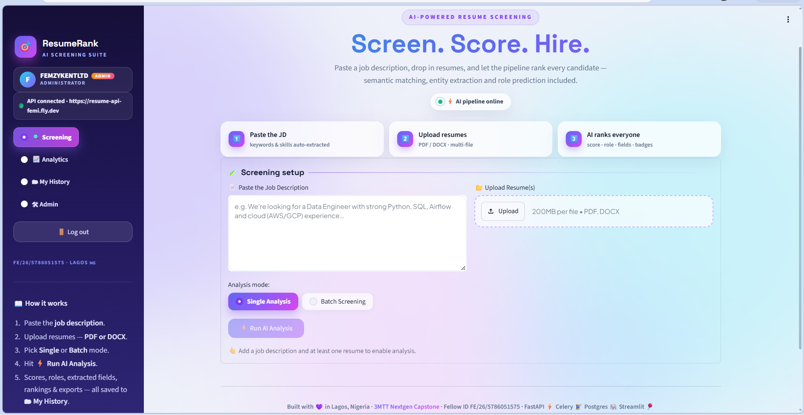

<div align="center">

# 🎯 ResumeRank — Resume Screening Classifier

**Compare PDF/DOCX resumes with a job description, review keyword matches, and export a ranked list.**

A **3MTT Nextgen capstone** built with Python, FastAPI and Streamlit.

[](https://github.com/FEMZYKENTLTD/Resume-Screening-Classifier/actions/workflows/deploy.yml)


[Demo](#demo-video) · [Screenshots](#screenshots) · [Features](#features) ·
[Quickstart](#getting-started) · [Architecture](#architecture) · [API](#api-reference) · [Testing](#testing-and-verification)

</div>

> **Scope:** this is a resume-review aid, not an automated hiring decision.
> The default score measures weighted keyword overlap, not competence, job performance,
> or the probability that someone should be hired. A human must review the original documents.

**Author:** Olufemi Benua Keripe (FEMZYK) · **3MTT Fellow ID:** FE/26/5786051575 · Lagos, Nigeria

**Release:** **v1.0** throughout the documentation. [`VERSION`](VERSION) stores `1.0.0`,
the machine-readable form of the same release, used by the API and `/health/ready`.
Maintenance fixes are grouped under [v1.0 release notes](#release-notes--v10).

## Demo video

**Recording link: not added yet.**

- [Two-minute narration, screen actions, and screen + webcam setup](docs/DEMO_SCRIPT.md)
- [Demo kit](demo/README.md): four **synthetic** resumes and one fictional job description
- [API documentation](https://resume-api-femi.fly.dev/docs)
- [Database connectivity check](https://resume-api-femi.fly.dev/health/ready)

Open your Render service's public URL from the Render dashboard, or run the UI locally
using the instructions below. Do a practice screening before recording; a healthy probe
alone does not prove that an analysis can be saved. The recording guide uses the actual
UI labels and does not require showing credentials, deployment dashboards, or real applicants.

## Screenshots

Actual application screenshots included in [`docs/images/`](docs/images/), not mockups
or the generic architecture illustration. Some on-screen wording predates the latest
copy edits; see [Features](#features) for the current behavior and limitations.

### Login and signup


### Screening dashboard



## Features

| Area | Implemented behavior |
|---|---|
| Uploads | PDF and DOCX parsing with PyMuPDF and python-docx; one or several files. The API limit is 10 MB per file. Scanned image PDFs need OCR elsewhere first. |
| Matching | A 0–100 weighted keyword-coverage score, with matched terms shown in the UI. The API also returns missing terms and skills in `match_details`. |
| Role suggestions | A TF-IDF + logistic-regression classifier for nine technical role families when its dependencies and artifact load; otherwise keyword profiles. This is separate from the match score. |
| Field extraction | Attempts to extract name, email, phone, experience and education. spaCy adds PERSON/ORG extraction when its model is available; regex heuristics are the fallback. Check extracted fields against the resume. |
| Results | Candidate rankings, charts, a matched-keyword cloud, and CSV/PDF downloads. The custom Streamlit styling is called “Aurora.” |
| Accounts and history | Signup/login, signed expiring session tokens, logout revocation, and account-linked API results. My History returns the latest 200 records, with filtering and exports. |
| Duplicate handling | By default, the same file bytes and JD submitted by the same account reuse a saved result. A cached rerun is not a new analysis record. |
| Dashboards | Analytics summarises saved records across the instance. Admin adds user statistics, per-user history and role management, gated by an admin account. |
| Supporting services | Alembic migrations, a separate Celery task implementation, Prometheus metrics and a provisioned Grafana dashboard in Docker Compose. These are not all required for an interactive screening. |

### What the score does — and does not — mean

[`scoring.py`](scoring.py) tokenises the JD, removes stopwords and selected recruitment
boilerplate, and checks which remaining terms occur in the resume. A JD term has weight
`1 + ln(frequency)`, doubled if it is in the technical-skill vocabulary. The score is the
rounded percentage of that weight covered by matched terms.

This is transparent, but limited:

- Different wording, missing synonyms, parsing errors and keyword stuffing can affect scores.
- It does not reliably interpret negation, distinguish “must have” from “nice to have,” or
  understand alternatives such as “BigQuery **or** Snowflake.” Both terms can count separately.
- A zero score means no counted terms matched this JD, not that a person has no useful skills.
  A high score does not verify qualifications, experience or suitability.
- The classifier's role label and confidence are **not** the candidate's match percentage.
- Matched keywords appear on the screening page. **There is no dedicated missing-skills panel
  in the current UI**; that breakdown is available in the API response.

**Model evidence:** the bundled artifact records 619 training examples across nine roles,
primarily generated resume-shaped text plus curated examples. Its metadata reports `1.0`
held-out accuracy on 141 generated/hand-written development examples. Much of that holdout
uses the same generator as training. The four demo PDFs are also synthetic. These are
small development checks, **not an independent real-applicant benchmark**, a fairness
assessment, or evidence of hiring accuracy. No measured time-saving claim is made here.

### Data and deployment limitations

Use the synthetic demo kit for public demonstrations. The database stores parsed resume
text and extracted contact fields for API analyses; local fallback results are not saved
by the UI, and a timed-out API request may still finish server-side. Check History before retrying.

This repository is **not presented as a hardened multi-tenant recruitment service**:

- `/single_analyze` permits anonymous requests. `/results/{job_id}` and `/analytics/summary`
  currently have no login requirement; results can include extracted personal details,
  and analytics includes recent filenames/job IDs. Private History does not make every API private.
- Restrict access, add result-ownership checks and rate limiting, review admin provisioning,
  and establish retention/deletion and backup policies before using real applicant data.
- Review Supabase table grants and RLS if its Data API is exposed. RLS advisories are separate
  from the enum incident below, but are not something to dismiss as harmless. CORS is not authentication.
- There is no claim of bias-free screening, accessibility certification, or NDPR/GDPR compliance.

## Architecture

The path used by the current UI is **synchronous**. Batch mode submits the files one at a time;
it does not enqueue them to Celery.

```text
Streamlit
  └─ POST /single_analyze (resume + JD, optionally X-User-Token)
       └─ FastAPI: parse → weighted keyword score → role/field extraction
            └─ SQLAlchemy → PostgreSQL (SQLite for local development)
                 └─ completed result returned in the same HTTP response

Streamlit → /history, /analytics/summary, /admin/* → saved records

Separate optional path:
explicit task caller → Redis → Celery tasks.analyze_resume_task → database
```

[`tasks.py`](tasks.py) includes optional semantic scoring: with `ENABLE_SEMANTIC=1` and
sentence-transformers installed, it blends 65% embedding similarity with 35% keyword score.
**That flag does not enable semantic scoring in `/single_analyze`.** Running the worker
container alone does not route UI requests through it. The API and default worker images
install scikit-learn and spaCy; the pretrained spaCy model install can fall back to heuristics.

## Project structure

```text
app.py                         Streamlit pages and exports
api_server.py                  HTTP API, accounts, history, analytics and admin
scoring.py / skills.py          Keyword scoring and skill vocabulary
roles.py / role_model.py        Role suggestions and model loading
parsing.py / extractors.py      Document parsing and field extraction
ner.py / matching_engine.py     Optional NER and semantic components
auth.py / database.py / models.py
                               Sessions and persistence
tasks.py                       Separate Celery task implementation
migrations/                    Alembic schema history
models/role_classifier.joblib   Bundled role classifier
training/                      Corpus generator, trainer and pseudonymisation tools
tests/                         Unit and integration tests
scripts/                       Admin recovery, NER installation, live UI checks
demo/                          Synthetic PDFs, JD and expected example results
docs/DEMO_SCRIPT.md             Two-minute recording guide
monitoring/                    Prometheus and Grafana configuration
Dockerfile.* / docker-compose.yml / fly.*.toml / render.yaml
                               Local stack and deployment configuration
VERSION                        1.0.0 (public label: v1.0)
```

## Getting started

### Option A — local Python demo (no Redis or Docker required)

Use Python **3.12** to match the container/CI configuration. Python 3.11 was also used for
the verification recorded below. SQLite is suitable for a local demonstration, not a
substitute for testing PostgreSQL behavior before deployment.

Clone the repository if you do not already have it:

```text
git clone https://github.com/FEMZYKENTLTD/Resume-Screening-Classifier.git
cd Resume-Screening-Classifier
```

**Windows PowerShell — terminal 1 (API):**

```powershell
python -m venv .venv
.\.venv\Scripts\Activate.ps1
python -m pip install -r requirements.txt
$env:DATABASE_URL = "sqlite:///./resume_demo.db"
$env:AUTH_SECRET_KEY = python -c "import secrets; print(secrets.token_urlsafe(48))"
if ($LASTEXITCODE -ne 0 -or [string]::IsNullOrWhiteSpace($env:AUTH_SECRET_KEY)) { throw "Secret generation failed" }
python -m alembic upgrade head
python -m uvicorn api_server:app --host 0.0.0.0 --port 8000
```

**PowerShell — terminal 2 (UI), in the same repository:**

```powershell
.\.venv\Scripts\Activate.ps1
$env:API_URL = "http://localhost:8000"
$env:ALLOW_LEGACY_LOGIN = "0"
python -m streamlit run app.py --server.address=0.0.0.0 --server.port=8501
```

If PowerShell blocks activation, invoke `.\.venv\Scripts\python.exe` instead of `python`
for the install, migration and server commands; activation is not required for that approach.

<details>
<summary>macOS / Linux equivalents</summary>

Terminal 1:

```bash
python -m venv .venv
source .venv/bin/activate
python -m pip install -r requirements.txt
export DATABASE_URL="sqlite:///./resume_demo.db"
export AUTH_SECRET_KEY="$(python -c 'import secrets; print(secrets.token_urlsafe(48))')"
python -m alembic upgrade head
python -m uvicorn api_server:app --host 0.0.0.0 --port 8000
```

Terminal 2, in the repository:

```bash
source .venv/bin/activate
export API_URL="http://localhost:8000"
export ALLOW_LEGACY_LOGIN=0
python -m streamlit run app.py --server.address=0.0.0.0 --server.port=8501
```

</details>

Open **http://localhost:8501** for the UI and **http://localhost:8000/docs** for the API.
Sign up before the demo; the API requires a username of at least three characters and a
password of at least eight. On a **private local instance**, a username of `admin` matches
the default admin allow-list. Do not rely on public self-signup to provision production admins.

The minimal install uses keyword role profiles and regex field extraction. To exercise the
bundled trained classifier and optional NER, install these in the API environment and restart it:

```bash
python -m pip install scikit-learn==1.9.0 spacy==3.8.16
python -m spacy download en_core_web_sm
```

The spaCy model needs a separate download. If unavailable, the API uses heuristics;
inspect `extracted_fields.extraction_method` rather than assuming NER ran.

### Option B — Docker Compose

With Docker and the Compose plugin installed:

```bash
docker compose up --build
```

This starts PostgreSQL, Redis, API, worker, Streamlit, Prometheus and Grafana. Migrations
run on API container startup. UI/API ports are the same as above; Prometheus is on
`http://localhost:9090` and Grafana on `http://localhost:3000` (local default: `admin` / `admin`).

**Local-development defaults only:** Compose has example DB/Grafana credentials and does
not currently pass `AUTH_SECRET_KEY` to the API. An unset key gives the API a random
per-process signing key, so restarts invalidate sessions. For stable sessions, set a random
secret in your shell or ignored `.env` and add this via a local `compose.override.yaml`:

```yaml
services:
  api:
    environment:
      AUTH_SECRET_KEY: ${AUTH_SECRET_KEY:?Set a random signing secret}
  streamlit:
    environment:
      ALLOW_LEGACY_LOGIN: "0"
```

Start with the override explicitly when using it:

```bash
docker compose -f docker-compose.yml -f compose.override.yaml up --build
```

Copying `.env.example` alone does **not** configure the application: Python does not
auto-load it, and Compose only passes variables referenced in its service configuration.
Do not expose these local defaults as a public deployment.

### Try the supplied inputs

1. Log in and select **🔍 Screening**.
2. Paste [`demo/job_description.txt`](demo/job_description.txt) into **📄 Paste the Job Description**.
3. Add the four files from [`demo/resumes/`](demo/resumes/) to **📂 Upload Resume(s)**.
4. Select **Batch Screening**, then **⚡ Run AI Analysis**.
5. Review **🏆 Candidate Rankings**, including the **Source** column, and **📤 Export Results**.
6. Open **🗂 My History** to confirm persistence, then **📈 Analytics** to see saved-record summaries.

`api` means a result returned from the API; `api (cached)` means a reused record. `local`
means the displayed result is a local fallback, not confirmation of a database write.
The sidebar's connection badge and the save caption alone are not proof.

## Configuration

Set variables in the process/container that uses them. See [`.env.example`](.env.example)
for additional examples; never commit credentials.

| Variable | Default / scope | Purpose |
|---|---|---|
| `DATABASE_URL` | Set explicitly; app fallback targets Compose's `db` host | SQLAlchemy connection; required by Alembic |
| `API_URL` | `http://localhost:8000` on UI | Backend URL used by Streamlit's server-side requests |
| `AUTH_SECRET_KEY` | Random per-process key if missing or a recognised placeholder | Set a stable, long random signing secret; ephemeral fallback is logged at CRITICAL level |
| `TOKEN_MAX_AGE_DAYS` | `7` | Token lifetime |
| `ADMIN_USERNAMES` / `ADMIN_EMAILS` | `admin` / empty | Grant admin on signup/login; configure before allowing public registration |
| `ADMIN_BOOTSTRAP_FIRST_USER` | `1` | Promote the oldest account if there is no admin; disable if not appropriate |
| `ADMIN_STRICT_SYNC` | `0` | `1` also revokes admins absent from the allow-lists |
| `ALLOW_LEGACY_LOGIN` | `1` on UI | Set `0` for API-account deployments; offline fallback has separate example credentials |
| `DEDUP_SCOPE` | `user` on API | `user`, `global` or `off`; cached results do not increase record counts |
| `DB_CONNECT_TIMEOUT` / `DB_POOL_RECYCLE` | `10` / `280` seconds | PostgreSQL connection timeout and pooled-connection recycling |
| `API_HEALTH_TIMEOUT` / `API_HEALTH_RETRIES` | `12` seconds / `3` attempts | UI connection probe |
| `API_ANALYZE_TIMEOUT` | `120` seconds | UI wait for an analysis response |
| `REDIS_URL` | `redis://redis:6379/0` | Optional Celery broker; use the appropriate TLS URL for managed Redis |
| `ENABLE_SEMANTIC` | Off; **worker only** | Optional embedding/keyword blend; does not change the synchronous API score |
| `CORS_ALLOW_ORIGINS` | `*` | Browser-origin policy, not access control |
| `DEBUG_ERRORS` | Off | Diagnostic exception details in error responses; keep off in public deployments |

## API reference

Account-protected endpoints use the **`X-User-Token`** header returned by signup/login.
“No auth” below describes the current implementation, not a recommendation for private data.

| Method | Endpoint | Auth | Description |
|---|---|---|---|
| GET | `/health` | None | Process liveness; returns `{"status":"ok"}` without touching the DB |
| GET | `/health/ready` | None | Executes `SELECT 1`; 200 on success, 503 on a database error; includes the version |
| POST | `/auth/signup` | None | Create an account and return a token |
| POST | `/auth/login` | None | Validate username/password and return a token/account details |
| GET | `/auth/me` | Account | Current account and admin status |
| POST | `/auth/logout` | Account | Revoke the caller's outstanding tokens across devices |
| POST | `/single_analyze` | Optional account | Multipart fields `resume` and `jd`; returns a completed result on success |
| GET | `/results/{job_id}` | None | Status, score, role, extracted fields and match details |
| GET | `/history` | Account | Latest 200 analyses for the caller |
| GET | `/analytics/summary` | None | Instance-wide status/score/role/skill summaries and recent records |
| GET | `/admin/overview` | Admin | User/job/status totals |
| GET | `/admin/users` | Admin | User registry with analysis statistics |
| GET | `/admin/users/{id}/jobs` | Admin | Per-user history |
| POST | `/admin/users/{id}/admin` | Admin | Grant/revoke admin using `{ "is_admin": true }` or `false` |
| GET | `/admin/trends?days=N` | Admin | Activity and distribution summaries |
| GET | `/metrics` | None | API Prometheus metrics; the worker has a separate configured metrics port |

Swagger UI is at `/docs` on the API server.

## Testing and verification

**Rechecked on 2026-09-05:** Python 3.11, pinned runtime/test dependencies,
scikit-learn 1.9.0 and spaCy 3.8.16.

| Test backend | Result |
|---|---|
| Disposable SQLite | **104 passed, 1 skipped** |
| Disposable PostgreSQL 16.2, with the actual Alembic migrations applied first | **104 passed, 1 skipped** |

The skip on both backends is the pretrained `en_core_web_sm` integration test: its weights were not installed.
The spaCy library's offline test path ran. A Starlette TestClient/httpx deprecation warning
was emitted; it did not fail the suite.

A separate local demo check applied the migrations to fresh SQLite, saved all four demo
PDF analyses, and confirmed four cached reruns did not add records. Login, batch results,
History, Analytics and Admin rendered without exceptions in Streamlit AppTest, with HTTP
calls routed to a local FastAPI TestClient. This was not a live deployment or browser test;
Streamlit also logged deprecation warnings for the existing HTML component calls.

To run locally, use a **new terminal with no production `DATABASE_URL`**. The suite creates
and modifies users and analyses. With that variable unset, `tests/conftest.py` supplies a
throwaway SQLite database:

```bash
python -m pip install -r requirements-dev.txt
python -m pytest -q
```

Optional ML tests skip when their dependencies are absent. Read the actual summary rather
than treating an old README count as a guarantee. Tests cover parsing, scoring, model
fallbacks, API writes, duplicate handling, auth/admin gates, UI error-response contracts,
enum binding and migration/model consistency. Celery tasks are exercised eagerly in-process,
not through a live Redis queue.

For PostgreSQL verification, point `DATABASE_URL` at a **fresh, disposable test database**, then:

```bash
python -m alembic upgrade head
python -m pytest -q
```

This tests against the migration-created schema and native enum behavior. SQLite cannot
substitute for PostgreSQL enum enforcement. The current Actions workflow runs the SQLite
suite and migration check; it does not provision a PostgreSQL test service.

[`scripts/verify_ui_live.py`](scripts/verify_ui_live.py) is a separate HTTP + Streamlit AppTest
harness, not a browser video test. It needs a running API/UI and disposable admin/non-admin
accounts configured through its environment variables. It writes data and revokes tokens;
do not aim it at real user accounts. Its older output labels mention a worker, but its
`/single_analyze` request follows the synchronous API path. **It was not rerun for this
README update; no live-E2E pass count or deployment status is claimed here.**

### Training and private data

```bash
python -m training.train_role_classifier
```

This retrains and **overwrites** the bundled model artifact, applying development-set gates.
It is not needed to run the demo. For a locally held, permissioned corpus, the optional
[`training/ingest_real_resumes.py`](training/ingest_real_resumes.py) tool accepts folders
named by role and writes pseudonymised training text. Its pattern-based scrubber/auditor
reduces obvious identifiers but is not guaranteed anonymisation. Do not commit raw resumes;
`training/real_corpus.jsonl` is ignored. Obtain permission and review residual personal data.

## Troubleshooting

| Symptom | What to check |
|---|---|
| `invalid input value for enum jobstatus: "COMPLETED"` or `"PROCESSING"` | Older ORM code stored Python enum **names**, while the migration uses lowercase **values**. The current `models.py` uses `values_callable` to align them. Deploy that code; an existing lowercase enum does not need an uppercase-label migration. |
| Analytics/Admin shows a storage 503 | Read the API logs for the actual error. A 503 does not by itself mean Supabase is paused. Connectivity, schema, permissions or a query error can all be involved. |
| `/health` is green but screening fails | Liveness checks no DB. `/health/ready` checks `SELECT 1` only: it **also cannot detect enum drift, missing tables or failed writes**. Run a synthetic screening and verify History as a functional check. |
| Results show `local` or History is empty | Check the Source column, login and API error. Local results are not uploaded later automatically. Restore service and rerun; first check whether a timed-out API request completed. |
| Counts do not increase on a rerun | The same account/file/JD normally hits the cache. History/analytics count saved records, not every button click. |
| API error JSON/HTML appears instead of usable data | `api_fetch_json()` now rejects non-success/error bodies as data. Affected pages should show **🔄 Retry now**, not index a `detail` error object as a summary. |
| No readable PDF text | Scanned images require OCR before upload; corrupted/encrypted documents may also fail parsing. |
| Missing or incorrect name/role | Check extraction/role method fields, optional dependencies, and document formatting. Extracted fields and role predictions need human review. |
| Sessions disappear on restart | A missing/placeholder `AUTH_SECRET_KEY` uses an ephemeral key. Configure a stable random secret; rotation deliberately invalidates existing sessions. |

## Deployment and monitoring

The repository supplies Fly API/worker configs, a Render UI config, and a GitHub Actions
workflow. PostgreSQL can be hosted on Supabase or another provider. Availability and which
services are actually running must be checked in the deployment, not inferred from these files.

| Location | Configuration |
|---|---|
| GitHub Actions secrets | `FLY_API_TOKEN`, `DATABASE_URL`, `REDIS_URL`, `AUTH_SECRET_KEY`, `RENDER_API_KEY`, `RENDER_STREAMLIT_ID` |
| Fly API | Database and auth settings; `fly.api.toml` runs `alembic upgrade head` on release |
| Fly worker | Database and Redis settings; separate optional app |
| Render UI | `API_URL` pointing to the API; set `ALLOW_LEGACY_LOGIN=0` for API-only accounts |

PRs run verification; pushes to `main` trigger the configured deploy jobs after verification.
**The workflow syncs `AUTH_SECRET_KEY` from GitHub to Fly on deployment.** Rotating only on
Fly is temporary: update the protected GitHub secret to the same intended value or a later
deploy can overwrite the rotation. Never put secret values in a recording, chat, or TOML.
Fly commands need the correct target, e.g. `fly logs --app resume-api-femi`.

- `/health` is the configured Fly liveness check and deliberately does not depend on storage.
- Point a separate uptime monitor at `/health/ready` for **database connectivity** alerts.
  Retain a synthetic write/read check to cover failures that `SELECT 1` cannot detect.
- The checked-in Fly config keeps one API machine running and disables automatic stop/start;
  do not assume it will wake automatically if manually stopped. Open the Render UI before recording.
- Compose includes API and worker metric scrapes plus Grafana provisioning. Worker task metrics
  do not measure the synchronous API's job throughput. This update does not verify live Grafana/worker operation.

## Release notes — v1.0

The public release remains **v1.0** (`VERSION`: `1.0.0`). This is a consolidated description
of the current implementation, including maintenance fixes, not a claim that all deployments
already contain them.

- PDF/DOCX screening, weighted keyword coverage, role suggestions, field extraction and exports.
- Accounts, token revocation on logout, per-account history/deduplication, analytics and admin controls.
- **PostgreSQL enum fix:** bind/read lowercase `JobStatus` values to match the existing migration;
  regression tests cover labels and PostgreSQL-dialect binding. The supplied incident logs identify
  this mismatch in failed status writes and analytics/admin filters, not a database outage.
- **UI error handling:** reject unsuccessful JSON responses as result data, guard decoding and
  offer retry panels; API failures can fall back to visibly labelled local scoring.
- **Database handling:** connection timeouts/recycling, narrower dashboard queries, and non-null
  timestamp declarations aligned with the migration. Per-account dedup fixes attribution separately
  from the enum failure; it is not a substitute for that fix.
- **Auth configuration:** replace the published default signing key with a random per-process
  fallback and a startup warning when no usable key is set. Production still needs a configured secret.
- **Health checks:** add `/health/ready` for DB connectivity while preserving `/health`'s liveness contract.
- Documentation now distinguishes implemented features, optional paths, measured checks and limitations;
  the [recording guide](docs/DEMO_SCRIPT.md) stays within what the current UI can demonstrate.

Earlier dated engineering notes remain in [`docs/audit_report.md`](docs/audit_report.md);
its historical counts and conclusions are not current deployment or security guarantees.

## Next steps

- Independent, permissioned evaluation on more varied resumes, including error and bias analysis.
- Result-ownership/access controls, rate limits, retention/deletion tools and audit logging.
- PostgreSQL-backed CI and functional write/read monitoring.
- Better requirement/synonym handling and a visible missing-term breakdown in the UI.
- OCR, broader language coverage and accessibility testing.

## Contributing and license

Open an issue or pull request with a reproducible example and relevant tests. Keep credentials,
raw resumes, recordings, local databases and generated datasets out of Git. Run the test suite
against disposable data before proposing changes. Distributed under the [MIT License](LICENSE).

## Author and acknowledgments

**Olufemi Benua Keripe (FEMZYK)** · 3MTT Nextgen Fellow · Lagos, Nigeria
[GitHub](https://github.com/FEMZYKENTLTD) · femzykenterprisesltd@gmail.com

Thanks to the [3MTT Programme](https://3mtt.nitda.gov.ng/), reviewers and fellow participants,
and to the maintainers of FastAPI, Streamlit, Celery, SQLAlchemy, spaCy and scikit-learn.
